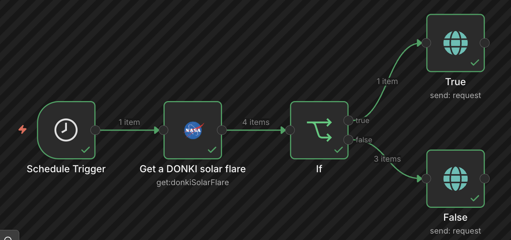
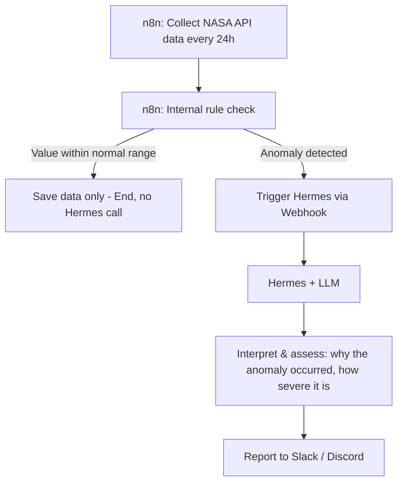

# NASA-Solar-Collector
Collect Solar Flare Using NASA API, n8n, Hermes Agent, Ollama

## Features

- Workflow for n8n to collect solar flare data from NASA DONKI API
- Collect solar flare data from NASA DONKI API
- Filter solar flare data based on class type
- Build Backend for Solar Flare Data with Go

## Current Architecture

## Future

## NASA Open API

[NASA Open API](https://api.nasa.gov/)
 
Go to the link above and register for the API Key.

Of Course this is free to use.

## Usage

Run the workflow to collect solar flare data
